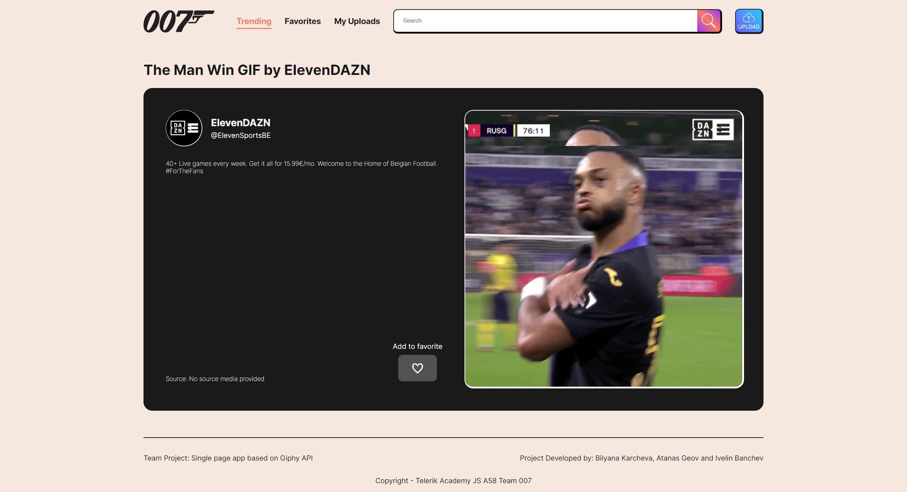
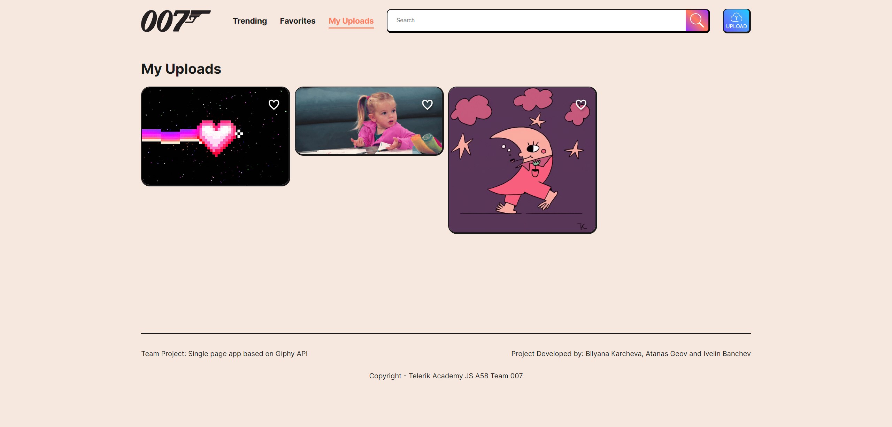
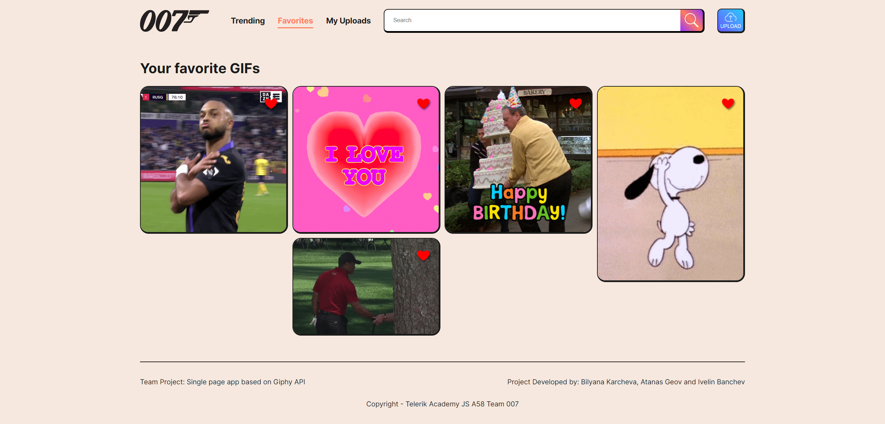
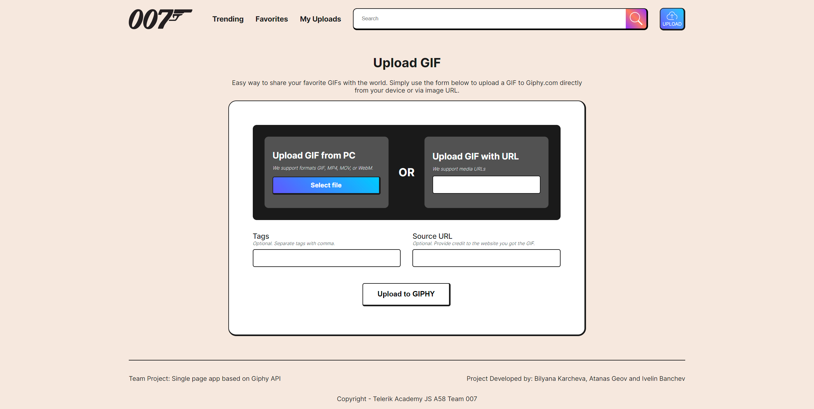

# Web Project 1: Giphy Single Page App

## Description
Welcome to our Giphy API-based single-page platform, the first of three team projects for the Telerik Alpha Program. This platform leverages the Giphy APIs to showcase trending GIFs and allows users to search for GIFs using specific queries. Users can also upload their own GIFs directly from a local file or via a file URL. All user-uploaded GIFs are conveniently stored and accessible on the "My Uploads" page. Additionally, the platform offers a favorites feature, enabling users to mark any GIF as a favorite for easy access later.

## Installation
1. Clone the repository to your local machine.
2. Run `npm install` to install all dependencies.
3. Start the application with the help of `Live Server` VSC extension.

## Creators
Bilyana Karcheva - [@bilyanakarcheva](https://github.com/bilyanakarcheva) 
Atanas Geov - [@AtanasGeov](https://github.com/AtanasGeov) 
Ivelin Banchev - [@banch3v](https://github.com/banch3v/) 

## Technologies used
JavaScript (vanilla) 
HTML 
CSS 
Giphy API 
ESLint 
git 

## Usage

### Trending GIFs Page

The "Trending GIFs" page showcases the latest 25 trending GIFs, providing a snapshot of what's currently popular. Each GIF is displayed with an option to add it to your favorites for easy access later. Clicking on a GIF will take you to a detailed page for that specific GIF, where you can view more information about it. This page is a dynamic and engaging way to discover new and trending content.

### GIF's Detailed Page

The "GIF's Detailed Page" provides an in-depth look at a specific GIF. Here, you can view a larger snippet of the GIF for a closer look. The page also displays information about the GIF's author, including their logo, name, username, and a description. Additionally, the source of the GIF is provided, giving you insight into where the GIF originated. Just like on the "Trending GIFs" page, you have the option to add the GIF to your favorites for easy access later.

### Search Page

The "Search" page offers a powerful tool for discovering new GIFs. Simply enter your search query into the search bar and hit enter. The page will then display all GIFs that match your search terms. Each GIF comes with the option to add it to your favorites for easy access later. Clicking on a GIF will take you to its detailed page, where you can view more information about it. The "Search" page makes it easy to find exactly what you're looking for.

### Favorites Page

The "Favorites" page is your personal collection of GIFs that you've marked as favorites. This page displays all your favorite GIFs in one place for easy access. Each GIF on this page has a link to its detailed page, where you can view more information about it. The "Favorites" page is a great way to keep track of the GIFs you love the most.

### Upload Page

The "Upload" page allows you to contribute your own GIFs to the platform. You can upload a GIF directly to Giphy from a local file or from a file URL. The page also provides options for adding additional parameters to the uploaded file, such as tags or a source URL. This makes it easy to categorize and provide context for your GIF. Once uploaded, your GIF will be available for all users to view, favorite, and share.

### My Uploads Page

The "My Uploads" page is a dedicated space for all the GIFs you've uploaded to the platform. Similar to the "Favorites" page, this page displays all your uploaded GIFs in one place for easy access. Each GIF on this page has a link to its detailed page, where you can view more information about it. The "My Uploads" page is a great way to keep track of and manage the GIFs you've contributed to the platform.

### James Bond / Logo Page

The "James Bond" page is a special feature of our platform. When you click on the site's logo, you're taken to this page which showcases a collection of James Bond-themed GIFs. It's a fun and unique way to explore content related to the iconic James Bond franchise. Just like on other pages, each GIF can be favorited for easy access later and has a link to its detailed page for more information.

